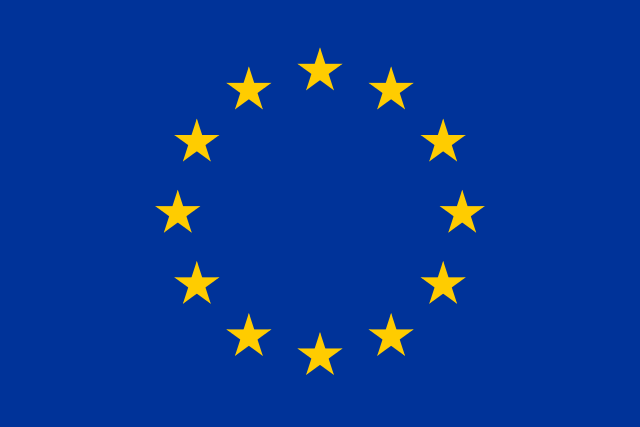

# Filip&nbsp;Úradník
I'm a Bachelor student of Computer Science at&nbsp;[MFF&nbsp;UK](https://mff.cuni.cz/).
For more info about me, take a look at&nbsp;my&nbsp;CV, either in&nbsp;[Czech](https://github.com/furadnik/cv/releases/download/latest/uradnik_cv_cz.pdf)
or&nbsp;[English](https://github.com/furadnik/cv/releases/download/latest/uradnik_cv_en.pdf), or&nbsp;visit my&nbsp;[personal&nbsp;website](https://furadnik.github.io/).

<<<<<<< HEAD
At [REU 2024](https://reu.dimacs.rutgers.edu/2024/), I work on _Truth Learning in a Social and Adversarial Setting_ with&nbsp;[Julia Križanová](https://reu.dimacs.rutgers.edu/~jk2238/), [Rhett Olson](https://reu.dimacs.rutgers.edu/~ro330/) and [Amanda Wang](https://reu.dimacs.rutgers.edu/~aw1115/).\
Our mentor is professor [Jie Gao](https://sites.rutgers.edu/jie-gao/about/).

_I am currently attending the [Research Experience for Undergraduates](https://reu.dimacs.rutgers.edu/) program at Rutgers University. See the [details of my project](https://reu.dimacs.rutgers.edu/~fu37/)._

=======
>>>>>>> 856ed63 (feat: make project more visible)
## Contact me

My office is in the CoRE building, room 434.

You can also send me an [email](mailto:uradnik@kam.mff.cuni.cz) or&nbsp;contact me on [Matrix](https://matrix.to/#/@furadnik:matrix.org).

# Truth Learning in Social and Adversarial Setting

At [REU 2024](https://reu.dimacs.rutgers.edu/2024/), I work on _Truth Learning in a Social and Adversarial Setting_ with&nbsp;[Julia Križanová](https://reu.dimacs.rutgers.edu/~jk2238/), [Rhett Olson](https://reu.dimacs.rutgers.edu/~ro330/), and&nbsp;[Amanda&nbsp;Wang](https://reu.dimacs.rutgers.edu/~aw1115/).
Our mentor is professor [Jie Gao](https://sites.rutgers.edu/jie-gao/about/).

## Week log

* _Week 1_: 05/29 --- 06/02
    - I did research about information cascades and voting.
    - I created a website for this project.
    - I started working on the initial presentation for our project.

## Acknowledgements

This project has received funding from the European Union’s Horizon 2020 research and innovation programme under the Marie Skłodowska-Curie grant agreement No 823748.
